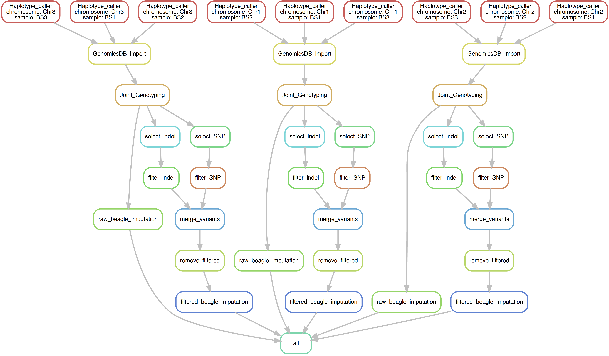

## GATK 4 Pipelines

[](https://snakemake.bitbucket.io)

We implemented the best practice recommendation pipeline for the GATK 4. The first step of the variant calling is to perform per sample variant discovery using `HaplotypeCaller`. This step outputs per sample `gVCF` which is then consolidated as a single genomic database using `GenomicsDBImport`. Afterwards, the joint genotyping of all animals are performed using `GenotypeGVCFs`.


### Input files

---

- The analysis-ready BAM files obtained from pre-processing pipelines. We used BAM files naming as `<sample_name>_recalibrated.bam`

- The cattle genome reference [UMD 3.1](http://bovinegenome.org/?q=node/61)
- Config file needs to be filled in with path of the required programs and files. 

### Dependencies

---

- [GATK v 4](https://software.broadinstitute.org/gatk/)


- [BCFtools](http://samtools.github.io/bcftools/)

- [BEAGLE v 4.1](https://faculty.washington.edu/browning/beagle/b4_1.html)

- [GATK v 4 Variant Filtration](https://software.broadinstitute.org/gatk/)

- [Java 8 or JDK 1.8](https://www.java.com/en/download/)

- Python 3. Recommended at minimum [3.6](https://www.python.org)

- [Snakemake](https://snakemake.readthedocs.io/en/stable/). Recommended at minimum 5.2.

     

### Output

---

- Variant per `chromosome` (including `SNP`  and `indels`, in VCF format which have been filtered and imputed. The GVCfs are also retained under gvcf/ folder organised per chromosome, enabling an efficient variant genotyping in batches. 


### Usage

---

The pipelines could run as with command as follow:

```bash
snakemake --snakefile gatk_snake.py 
```


### The pipelines visualization

---


The pipelines run on the per `chromosome` interval, which visualized as follow:




