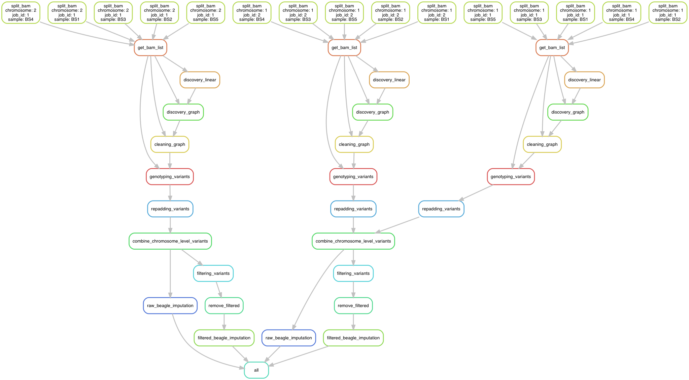

## Graphtyper Pipelines 

[](https://snakemake.bitbucket.io)

This pipeline based on the `graphtyper pipelines` as in [here](https://github.com/DecodeGenetics/graphtyper-pipelines). `Graphtyper` locally-realigns the reads mapped by `BWA` to a variation-aware graph. The pipelines consists of 4 steps that are executed consecutively. The first two step is variant discovery, where it first discover variants from linear reference and then used the variants identified to augment the reference genome to discover more variants in the second step. The third step is to clean the graph from complex variation based on the unobserved haplotypes from the reads data. And the final iteration is used to output genotypes based from the realigned reads.

For installations of the custom modified software for cattle genome, please see [here](install.md) 

### Input files

------

- The analysis-ready BAM files obtained from pre-processing pipelines. We used the convention for BAM file naming as `<sample_name>_recalibrated.bam`
- The cattle genome reference [UMD 3.1](http://bovinegenome.org/?q=node/61). 
- Config file needs to be filled in with path of the required programs and files. 

### Dependencies

------

- [Graphtyper v1.3](https://github.com/DecodeGenetics/graphtyper)

- [SAMtools v1.8](http://samtools.sourceforge.net/)

- [VT](https://genome.sph.umich.edu/wiki/Vt)

- bgzip and tabix; a part of [htslib](https://github.com/samtools/htslib)

- [BEAGLE v 4.1](https://faculty.washington.edu/browning/beagle/b4_1.html)

- [VCFLIB](https://github.com/vcflib/vcflib)

- [Java 8 or JDK 1.8](https://www.java.com/en/download/)

- Python 3. Recommended at minimum [3.6](https://www.python.org)

- [Snakemake](https://snakemake.readthedocs.io/en/stable/). We used version 5.2.

     

### Output

------

- Variant (including `SNP`  and `indels`), in VCF format which have been filtered and imputed per `chromosome` basis. 

  

### Usage

------

The pipelines could be run as follow:

```bash
snakemake --snakefile graph_snake.py 
```


### The pipelines visualization

------

The Graphtyper runs per `chunk` , we used 1 MB region size which are then joined to a chromosome level. Filtering and imputation are done per chromosome basis




