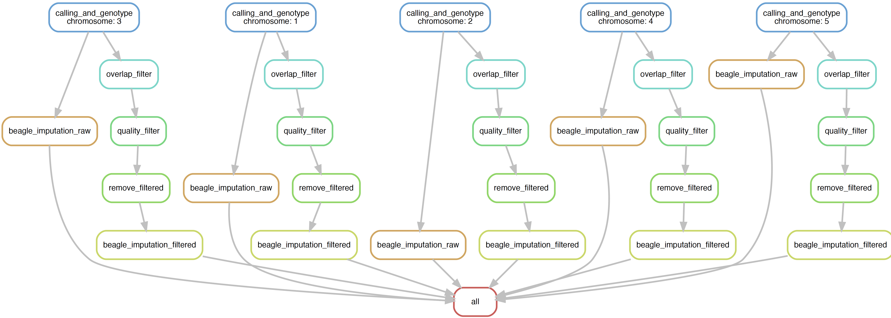

##  SAMtools Pipelines 

[](https://snakemake.bitbucket.io)

SAMtools infer directly the variants and genotype from the aligned reads, this has advantage for fast-processing for small number of samples and when the priority is only on the SNPs discovery. SAMtools employ two utilities for sequence variant genotyping; namely `mpileup` which collect the likelihood for all possible genotypes and the `bcftools call` which actually call and genotype the variants. 


### Input files

------

- The analysis-ready BAM files obtained from pre-processing pipelines. We used the convention for BAM file naming as `<sample_name>_recalibrated.bam`
- The cattle genome reference [UMD 3.1](http://bovinegenome.org/?q=node/61)
- Config file needs to be filled in with path of the required programs and files. 

### Dependencies

------

- [SAMtools min v1.8](http://samtools.sourceforge.net/)

- [BCFtools](http://samtools.github.io/bcftools/)

- bgzip and tabix; a part of [htslib](https://github.com/samtools/htslib)

- [BEAGLE v 4.1](https://faculty.washington.edu/browning/beagle/b4_1.html)

- [GATK v 4 Variant Filtration](https://software.broadinstitute.org/gatk/)

- [Java 8 or JDK 1.8](https://www.java.com/en/download/)

- Python 3. Recommended at minimum [3.6](https://www.python.org)

- [Snakemake](https://snakemake.readthedocs.io/en/stable/). Recommended at minimum 5.2.

- [PyVCF](https://pyvcf.readthedocs.io/en/latest/index.html)

     

### Output

------

- Variant per `chromosome` (including `SNP`  and `indels`, in VCF format which have been filtered and imputed) 

  

### Usage

------

The pipelines could run with command as follow  

```bash
snakemake --snakefile sam_snake.py 
```


### The pipelines visualization

------

The pipelines run on the per `chromosome` interval. The simplified pipeline run as follow:




